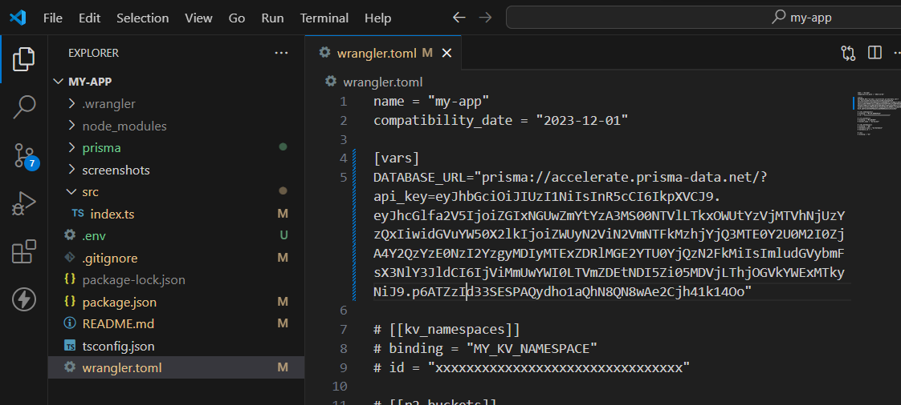

# Medium-Blog


## Installation

Initialize a `hono` based cloudflare worker app 

```
npm create hono@latest 
```

First, install Prisma using npm:

```bash
npm install prisma
```

Next, initialize Prisma in your project directory:

```bash
npx prisma init
```

## Configuring Database Pooling

### 0. Obtained Database url from avien or neon


### 1. Obtain a Pooling URL from Prisma Accelerate [Project: Funny Orange Orangutan environments]

After initializing Prisma, you'll receive a pooling URL from Prisma Accelerate. Make sure to copy this URL as it will be used to connect to your database.

### 2. Set Up Environment Variables

Create a `.env` file in the root directory of your project and paste the database URL obtained from Prisma Accelerate:

```
DATABASE_URL=<your_database_url_here>
```

Replace `<your_database_url_here>` with the pooling URL you obtained from Prisma.

### 3. Configure `wrangle.toml`

Open the `wrangle.toml` file in your project directory and set the `pooling_url` to the pooling URL you obtained from Prisma Accelerate:

```toml
[vars]
DATABASE_URL = "<your_database_url_here>"
```

Replace `<Prisma_Accelerated_PoolingURL>` with the pooling URL you obtained from Prisma.




### 4. Add User, Post Schema Under schema.prisma and migrate prisma

```
npx prisma migrate dev --name init_schema
```

### 5. Generate the prisma client
Client generation is for get the classes for what we written in `schema.prisma` file. Therse class are stored inside node modules and used for database operations

```
npx prisma generate --no-engine
``` 
### 6. Add the accelerate extension
npm install @prisma/extension-accelerate

### 7. Initialize the prisma client
```
import { PrismaClient } from '@prisma/client/edge'
import { withAccelerate } from '@prisma/extension-accelerate'

const prisma = new PrismaClient({
    datasourceUrl: env.DATABASE_URL,
}).$extends(withAccelerate())
```

### 8. Create Routes & add Bindings for wrangler.toml 
```
added other env variables into the wrangler.toml file and also added inside Binding to access within index.ts or any other user, blog routes
```